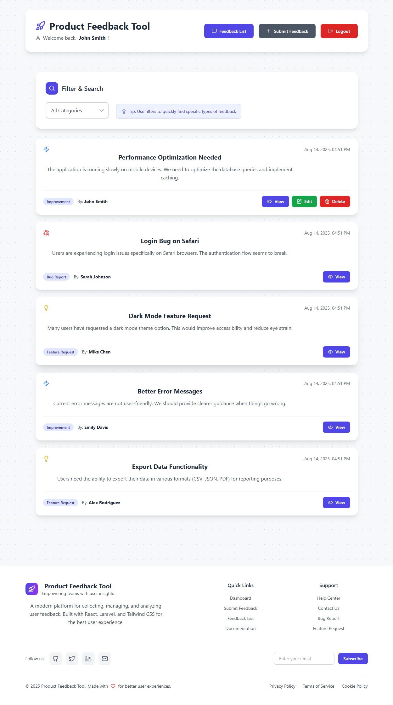

# 🚀 Product Feedback Tool

A modern, full-stack web application for collecting, managing, and analyzing user feedback. Built with React frontend and Laravel backend, featuring real-time collaboration, user mentions, and a professional design system.




## ✨ Features

### 🔐 Authentication & User Management

-   **User Registration & Login** with Laravel Sanctum
-   **Demo Accounts** for easy testing and demonstration
-   **Secure Session Management** with JWT tokens
-   **User Profile Management**

### 📝 Feedback Management

-   **Create & Edit Feedback** with rich text descriptions
-   **Category Classification**: Bug Reports, Feature Requests, Improvements, General
-   **Status Tracking** and priority management
-   **Search & Filtering** by category, date, and content
-   **Pagination** for large feedback collections

### 💬 Real-time Collaboration

-   **Comment System** with threaded discussions
-   **User Mentions** (@username) with intelligent parsing
-   **Real-time Updates** for collaborative feedback
-   **Notification System** for mentions and updates

### 🎨 Modern UI/UX

-   **Responsive Design** optimized for all devices
-   **Professional Icon System** using Lucide React
-   **Tailwind CSS** for consistent styling
-   **Dark/Light Theme Support**
-   **Smooth Animations** and transitions
-   **Purple Dot Pattern** background for visual appeal

### 🔍 Advanced Features

-   **Smart Search** with category filtering
-   **User Role Management** (Admin, User)
-   **Export Functionality** for feedback data
-   **Analytics Dashboard** with feedback insights
-   **API Documentation** for developers

## 🛠️ Technology Stack

### Frontend

-   **React 19.1.1** - Modern React with hooks
-   **Tailwind CSS 3.4.0** - Utility-first CSS framework
-   **Lucide React** - Professional icon library
-   **Axios** - HTTP client for API requests
-   **React Router** - Client-side routing

### Backend

-   **Laravel 10.x** - PHP web framework
-   **MySQL/PostgreSQL** - Database
-   **Laravel Sanctum** - API authentication
-   **Eloquent ORM** - Database management
-   **Laravel Migrations** - Database schema management

### Development Tools

-   **ESLint** - Code quality and consistency
-   **PostCSS** - CSS processing
-   **Autoprefixer** - CSS vendor prefixing
-   **Git** - Version control

## 🚀 Quick Start

### Prerequisites

-   **Node.js** 16+ and **npm** 8+
-   **PHP** 8.1+ with Composer
-   **MySQL** 8.0+ or **PostgreSQL** 13+
-   **Git** for version control

### 1. Clone the Repository

```bash
git clone https://github.com/ryan7998/product-feedback-tool.git
cd product-feedback-tool
```

### 2. Backend Setup (Laravel)

```bash
# Install PHP dependencies
composer install

# Copy environment file
cp .env.example .env

# Generate application key
php artisan key:generate

# Configure database in .env file
DB_CONNECTION=mysql
DB_HOST=127.0.0.1
DB_PORT=3306
DB_DATABASE=feedback_tool
DB_USERNAME=your_username
DB_PASSWORD=your_password

# Run database migrations
php artisan migrate

# Seed demo data
php artisan db:seed

# Start Laravel server
php artisan serve
```

### 3. Frontend Setup (React)

```bash
cd frontend

# Install dependencies
npm install

# Copy environment file
cp env.example .env.local

# Configure API URL in .env.local
REACT_APP_API_BASE_URL=http://localhost:8000/api
REACT_APP_ENVIRONMENT=development

# Start development server
npm start
```

### 4. Access the Application

-   **Frontend**: http://localhost:3000
-   **Backend API**: http://localhost:8000/api
-   **Demo Accounts**: See login page for credentials

## 🏗️ Project Structure

```
product-feedback-tool/
├── frontend/                 # React frontend application
│   ├── public/              # Static assets
│   ├── src/                 # Source code
│   │   ├── components/      # React components
│   │   │   ├── auth/        # Authentication components
│   │   │   ├── feedback/    # Feedback management
│   │   │   ├── common/      # Shared components
│   │   │   └── ui/          # UI component library
│   │   ├── contexts/        # React contexts
│   │   ├── config/          # Configuration files
│   │   └── App.js           # Main application
│   ├── tailwind.config.js   # Tailwind configuration
│   └── package.json         # Frontend dependencies
├── database/                 # Database migrations & seeders
├── app/                      # Laravel application logic
├── routes/                   # API routes
├── config/                   # Laravel configuration
└── README.md                 # This file
```

## 🎯 Key Components

### Frontend Components

-   **Dashboard** - Main application interface
-   **FeedbackList** - Display and manage feedback items
-   **FeedbackForm** - Create and edit feedback
-   **FeedbackDetail** - View feedback with comments
-   **Login/Register** - Authentication forms
-   **Footer** - Application footer with links

### Backend Features

-   **User Authentication** - Registration, login, logout
-   **Feedback API** - CRUD operations for feedback
-   **Comment System** - Threaded discussions
-   **User Management** - Profile and role management
-   **Search & Filtering** - Advanced query capabilities

## 🔧 Configuration

### Environment Variables

```bash
# Frontend (.env.local)
REACT_APP_API_BASE_URL=http://localhost:8000/api
REACT_APP_ENVIRONMENT=development

# Backend (.env)
APP_NAME="Product Feedback Tool"
APP_ENV=local
APP_DEBUG=true
APP_URL=http://localhost:8000

DB_CONNECTION=mysql
DB_HOST=127.0.0.1
DB_PORT=3306
DB_DATABASE=feedback_tool
DB_USERNAME=your_username
DB_PASSWORD=your_password
```

### Tailwind CSS Configuration

The project uses a custom Tailwind configuration with:

-   **Custom color palette** matching the design system
-   **Typography scales** for consistent text sizing
-   **Shadow system** for depth and hierarchy
-   **Responsive breakpoints** for mobile-first design

## 🚀 Deployment

### Production Build

```bash
# Frontend production build
cd frontend
npm run build:prod

# The build/ folder contains production-ready files
```

### Hostinger Deployment

1. **Build for Production**: Use `scripts/build-prod.bat` (Windows) or `scripts/build-prod.sh` (Linux/Mac)
2. **Upload Files**: Upload `build/` folder contents to `public_html/`
3. **Configure Backend**: Deploy Laravel API to same domain
4. **Update CORS**: Configure CORS settings for production domain

See `frontend/DEPLOYMENT.md` for detailed deployment instructions.

## 🧪 Testing

### Frontend Testing

```bash
cd frontend
npm test
```

### Backend Testing

```bash
php artisan test
```

## 📱 Demo Accounts

For testing purposes, the following demo accounts are available:

-   **John Smith**: john@example.com / password
-   **Jane Doe**: jane@example.com / password
-   **Admin User**: admin@example.com / admin123

## 🤝 Contributing

1. **Fork** the repository
2. **Create** a feature branch (`git checkout -b feature/amazing-feature`)
3. **Commit** your changes (`git commit -m 'Add amazing feature'`)
4. **Push** to the branch (`git push origin feature/amazing-feature`)
5. **Open** a Pull Request

## 📄 License

This project is licensed under the MIT License - see the [LICENSE](LICENSE) file for details.

## 🙏 Acknowledgments

-   **Laravel** team for the amazing PHP framework
-   **React** team for the frontend library
-   **Tailwind CSS** for the utility-first CSS framework
-   **Lucide** for the beautiful icon library

## 📞 Support

-   **GitHub Issues**: [Report bugs or request features](https://github.com/ryan7998/product-feedback-tool/issues)
-   **Documentation**: Check the `docs/` folder for detailed guides
-   **Email**: Contact the development team for support

---

**Made with ❤️ for better user experiences**

_Product Feedback Tool - Empowering teams with user insights_
